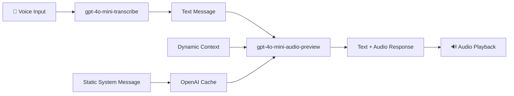

# 🎤 WatchBuddy - YouTube Watching Assistant Chrome Extension

An intelligent Chrome browser extension that provides AI-powered voice assistance for YouTube learners. Users can pause while watching YouTube videos and ask questions through voice input. The AI responds intelligently based on video content and context, helping users better understand the learning material.


## ✨ Core Features

### 🎯 Smart Voice Q&A
- **Separated Audio Pipeline**: Voice transcription → AI conversation → Audio response
- **Context Understanding**: Based on full video transcripts and current timestamp
- **Multi-language Support**: Automatic voice language detection with multilingual responses
- **OpenAI Prefix Caching**: Optimized for multi-turn conversations with cost reduction

### 🔊 Advanced Audio Processing
- **Smart Recording**: VAD (Voice Activity Detection) for automatic speech end detection
- **High-Quality Transcription**: Using `gpt-4o-mini-transcribe` model
- **Natural Speech Synthesis**: AI-generated audio responses with `gpt-4o-mini-audio-preview`
- **Audio ID Caching**: Assistant audio responses are cached and reused efficiently

### 📚 Intelligent Subtitle Extraction
- **Automatic Retrieval**: Supports YouTube native subtitles and auto-translated captions
- **Precise Timestamp Matching**: Provides relevant content based on current playback time
- **Manual Upload Support**: Backup SRT file upload when auto-extraction fails
- **Multi-language Subtitles**: Prioritizes English with support for all available languages

### 🔄 Optimization Features
- **Conversation History**: Per-video conversation management with up to 20 messages
- **Audio ID References**: Reuse assistant audio responses to reduce bandwidth
- **Dynamic Context**: Current timestamp and relevant subtitles updated per query
- **Cost Optimization**: Significantly reduced token consumption through caching

## 🚀 Quick Start

### 1. Installation

#### Developer Mode Installation (Recommended)
1. Download or clone this project locally
2. Open Chrome browser and navigate to `chrome://extensions/`
3. Enable "Developer mode" in the top right corner
4. Click "Load unpacked"
5. Select the project root directory
6. Extension installed successfully!

#### Chrome Web Store Installation (Coming Soon)
```
Will be available on Chrome Web Store soon...
```

### 2. API Configuration

1. Click the extension icon to open the configuration panel
2. Enter your OpenAI API key (format: `sk-...`)
3. Click "Save Configuration"
4. Click "Test API Connection" to verify the setup

> 🔑 **Get API Key**: Visit [OpenAI Platform](https://platform.openai.com/api-keys) to create an API key

### 3. Start Using

1. Open any YouTube video page
2. You'll see a purple 🎤 floating button on the right side
3. Click the button to start recording (smart VAD or 5-second fixed)
4. Ask your question, for example:
   - "Can you repeat what he just said?"
   - "What does this concept mean?"
   - "Can you explain this part again?"
5. AI will automatically respond with both text and audio

## 🛠️ Technical Architecture

### Core Technology Stack
```
Frontend: Vanilla JavaScript + HTML5 + CSS3
Audio: Web Audio API + MediaRecorder API + VAD
AI Services: OpenAI API (gpt-4o-mini-transcribe + gpt-4o-mini-audio-preview)
Chrome Extension: Manifest V3
Subtitle: Third-party API + Custom Parser + Manual Upload
Caching: OpenAI Prefix Caching + Audio ID References
```

### Separated Audio Pipeline


### Project Structure
```
VideoWatchingAssistant/
├── chrome-extension/
│   ├── manifest.json              # Extension configuration
│   ├── src/
│   │   ├── content.js             # Main logic - YouTube page injection
│   │   ├── background.js          # Background service worker
│   │   ├── popup.html            # Configuration UI
│   │   ├── popup.js              # Configuration logic
│   │   ├── styles.css            # UI styles
│   │   └── utils/
│   │       ├── openai-client.js  # OpenAI client with audio optimization
│   │       ├── subtitle-extractor.js  # Subtitle extraction
│   │       ├── voice-recorder.js # VAD-based smart recording
│   │       └── crypto-js.min.js  # Encryption library
│   ├── icons/                    # Extension icons
│   └── GPT4O_AUDIO_UPGRADE.md   # Technical upgrade documentation
├── README.md                     # Project documentation
└── reference-get-subtitle.js    # Original subtitle extraction reference
```

## 📊 API Cost Analysis

### Usage Cost (Per Conversation)
- **Voice Transcription**: ~$0.006/minute (5-second recording ≈ $0.0005)
- **AI Conversation**: ~$0.0015/1000 tokens (average 200 tokens ≈ $0.0003)  
- **Audio Generation**: ~$0.015/1000 characters (average 100 characters ≈ $0.0015)

**Total per conversation: ~$0.0023 (≈ ¥0.017)**

### Monthly Cost Estimation
- **Light Usage** (5 conversations/day): ~$0.35/month
- **Medium Usage** (20 conversations/day): ~$1.40/month
- **Heavy Usage** (50 conversations/day): ~$3.50/month

### Cost Optimization Benefits
- **OpenAI Prefix Caching**: Static system messages cached server-side
- **Audio ID References**: Assistant audio responses reused across conversations
- **Text-only User Input**: User voice transcribed once, subsequent interactions use text
- **Multi-turn Efficiency**: Significant token savings in extended conversations

## 🎯 Use Cases

### Learning Scenarios
```javascript
// Example Conversation
User: "Can you repeat what he just said?"
AI: "The speaker mentioned that database design is crucial for project success. He explained that databases should be designed to meet specific requirements and ensure efficient data storage and retrieval."

User: "What are the specific requirements?"
AI: "The specific requirements include data integrity, scalability, performance optimization, and security. The speaker emphasized that these should be defined before starting the database design process."
```

### Educational Content
- 🔬 **Science Courses**: Explaining complex concepts and experimental procedures
- 💻 **Programming Tutorials**: Code explanation and debugging techniques
- 📈 **Business Analysis**: Data interpretation and case studies
- 🎨 **Design Courses**: Creative concepts and technique explanations
- 🌍 **Language Learning**: Pronunciation help and grammar clarification

## ⚙️ Advanced Configuration

### API Model Settings
```javascript
// Configurable in openai-client.js
const apiSettings = {
    transcription: {
        model: 'gpt-4o-mini-transcribe',
        response_format: 'text'
    },
    audioCompletion: {
        model: 'gpt-4o-mini-audio-preview',
        modalities: ['text', 'audio'],
        max_completion_tokens: 1024,
        temperature: 1.0,
        audio: {
            voice: 'alloy',
            format: 'wav'
        }
    }
};
```

### Voice Options
| Voice Name | Characteristics | Best For |
|------------|----------------|----------|
| alloy | Neutral, clear | General learning |
| echo | Male, stable | Technical content |
| fable | Gentle, friendly | Language learning |
| onyx | Deep, professional | Business content |
| nova | Young, energetic | Science content |
| shimmer | Female, warm | Humanities content |

### Caching Configuration
```javascript
// Conversation and caching settings
const cacheSettings = {
    maxHistoryLength: 20,        // Messages per video
    maxVideoCount: 5,            // Cached video conversations
    audioExpiry: 5 * 60 * 1000,  // Audio cache cleanup interval
    contextSentencesBefore: 5    // Subtitle context range
};
```

## 🔧 Development Guide

### Local Development
```bash
# 1. Clone the project
git clone https://github.com/your-username/youtube-voice-assistant.git
cd youtube-voice-assistant

# 2. Load into Chrome
# Open chrome://extensions/
# Enable Developer mode
# Click "Load unpacked"
# Select chrome-extension/ directory
```

### Testing Tools
The project includes several testing utilities:
```
chrome-extension/
├── test-vad.html                 # VAD functionality testing
├── test-subtitle-debug.html      # Subtitle extraction debugging
├── test-encryption-debug.html    # Encryption validation
└── start-test-server.py         # Local test server
```

### Debug Console Outputs
```javascript
// Performance timing
⏱️ ===== Smart Voice Query (Separated) 时间统计 =====
🎤 录音阶段:     2847ms
🎯 转录+对话:    2156ms
📢 音频播放:     3200ms
📊 AI处理时间: 2156ms (26% of total)

// Caching efficiency
💾 静态系统消息长度: 1250 字符 (可缓存)
🔄 动态系统消息长度: 125 字符
💾 助手音频缓存效率: 75.0% (3/4)
🎤 用户音频消息: 4 (始终重新发送)
```

### Custom Subtitle Parsing
```javascript
// Extend subtitle-extractor.js for additional formats
async function parseCustomSubtitles(content, format) {
    switch(format) {
        case 'vtt':
            return parseVTTToTimestamps(content);
        case 'ass':
            return parseASSToTimestamps(content);
        default:
            return parseSRTToTimestamps(content);
    }
}
```

## 📈 Performance Features

### Smart Recording
- **VAD Integration**: Automatic speech end detection using neural networks
- **Fallback Mechanism**: Traditional 5-second recording when VAD fails
- **Audio Preprocessing**: Noise reduction and format optimization

### Conversation Management
- **Per-Video Isolation**: Separate conversation history for each video
- **LRU Cache**: Automatic cleanup of old video conversations
- **Context Preservation**: Historical dynamic context saved per message

### Error Handling
- **Graceful Degradation**: VAD failures automatically fallback to traditional recording
- **Network Resilience**: Robust error handling for API failures
- **User Feedback**: Clear status updates throughout the process

## 🌟 Recent Updates

### Major Architecture Upgrade
- **Separated Audio Processing**: Transcription and conversation now use different specialized models
- **OpenAI Prefix Caching**: Static system messages cached for cost efficiency
- **Audio ID References**: Assistant audio responses cached and reused
- **Enhanced Context Management**: Dynamic timestamp and subtitle context per query

### Performance Improvements
- **Reduced Token Usage**: Significant cost savings through intelligent caching
- **Faster Response**: Optimized API calls and reduced data transmission
- **Better Accuracy**: Specialized transcription model for improved speech recognition

## 🤝 Contributing

We welcome contributions! Please see our contributing guidelines:

1. Fork the repository
2. Create a feature branch (`git checkout -b feature/amazing-feature`)
3. Commit your changes (`git commit -m 'Add amazing feature'`)
4. Push to the branch (`git push origin feature/amazing-feature`)
5. Open a Pull Request

## 📄 License

This project is licensed under the MIT License - see the [LICENSE](LICENSE) file for details.

## 🙏 Acknowledgments

- [OpenAI](https://openai.com/) for providing the AI models
- [Chrome Extensions API](https://developer.chrome.com/docs/extensions/) for the platform
- [VAD Web](https://github.com/ricky0123/vad) for voice activity detection
- YouTube for the platform and subtitle access

## 📞 Support

If you encounter any issues or have questions:

1. Check the [Issues](https://github.com/your-username/youtube-voice-assistant/issues) page
2. Create a new issue with detailed description
3. Join our community discussions

---

**Built with ❤️ for learners worldwide**