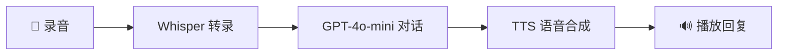

# 🎤 YouTube语音助手 Chrome扩展

一个智能的Chrome浏览器扩展，为YouTube学习者提供AI语音助手功能。用户在观看YouTube视频时，可以随时暂停并通过语音提问，AI会基于视频内容和上下文智能回答，帮助用户更好地理解学习内容。


## ✨ 核心功能

### 🎯 智能语音问答
- **三步流水线**: 语音转文字 → AI对话 → 语音回复
- **上下文理解**: 基于视频完整字幕和当前时间点
- **多语言支持**: 自动识别语音语言，支持多语言问答

### 🔊 实时音频处理
- **高质量录音**: 5秒智能录音，自动降噪
- **快速转录**: 使用OpenAI Whisper模型
- **自然语音合成**: 11种不同声音可选

### 📚 字幕智能提取
- **自动获取**: 支持YouTube原生字幕和自动翻译字幕
- **时间戳精确匹配**: 基于当前播放时间提供相关内容
- **多语言字幕**: 优先选择英文，支持所有可用语言

## 🚀 快速开始

### 1. 安装扩展

#### 开发者模式安装 (推荐)
1. 下载或克隆此项目到本地
2. 打开Chrome浏览器，进入 `chrome://extensions/`
3. 开启右上角的"开发者模式"
4. 点击"加载已解压的扩展程序"
5. 选择项目根目录
6. 扩展安装完成！

#### 从Chrome Web Store安装 (待上架)
```
即将上架Chrome Web Store，敬请期待...
```

### 2. 配置API密钥

1. 点击扩展图标打开配置面板
2. 输入你的OpenAI API密钥 (格式: `sk-...`)
3. 点击"保存配置"
4. 点击"测试API连接"确认配置正确

> 🔑 **获取API密钥**: 访问 [OpenAI Platform](https://platform.openai.com/api-keys) 创建API密钥

### 3. 开始使用

1. 打开任意YouTube视频页面
2. 你会看到右侧出现一个紫色的🎤浮动按钮
3. 点击按钮开始录音 (5秒)
4. 说出你的问题，例如:
   - "Can you repeat what he just said?"
   - "What does this concept mean?"
   - "Can you explain this part again?"
5. AI会自动回答并播放语音

## 🛠️ 技术架构

### 核心技术栈
```
Frontend: Vanilla JavaScript + HTML5 + CSS3
Audio: Web Audio API + MediaRecorder API
AI Service: OpenAI API (Whisper + GPT-4o-mini + TTS)
Chrome Extension: Manifest V3
Subtitle: Third-party API + Custom Parser
```

### 三步API流水线


### 文件结构
```
VideoWatchingAssistant/
├── manifest.json              # 扩展配置文件
├── src/
│   ├── content.js             # 主要逻辑 - 注入YouTube页面
│   ├── background.js          # 后台服务worker
│   ├── popup.html            # 配置界面HTML
│   ├── popup.js              # 配置界面逻辑
│   ├── styles.css            # 界面样式
│   └── utils/
│       ├── crypto-js.min.js  # 加密库
│       ├── subtitle-extractor.js  # 字幕提取器
│       └── openai-client.js  # OpenAI客户端
├── icons/                    # 扩展图标
├── README.md                # 项目文档
└── document                 # 需求文档
```

## 📊 API成本预估

### 使用成本 (每次对话)
- **语音转录**: ~$0.006/分钟 (5秒录音 ≈ $0.0005)
- **AI对话**: ~$0.0015/1000 tokens (平均200 tokens ≈ $0.0003)
- **语音合成**: ~$0.015/1000字符 (平均100字符 ≈ $0.0015)

**总计每次对话约 $0.0023 (约 ¥0.017)**

### 月度成本预估
- **轻度使用** (每天5次): ~$0.35/月
- **中度使用** (每天20次): ~$1.40/月  
- **重度使用** (每天50次): ~$3.50/月

## 🎯 使用场景

### 学习场景
```javascript
// 示例对话
用户: "Can you repeat what he just said?"
AI: "The speaker mentioned that database design is crucial for project success. He explained that databases should be designed to meet specific requirements and ensure efficient data storage and retrieval."

用户: "What are the specific requirements?"
AI: "The specific requirements include data integrity, scalability, performance optimization, and security. The speaker emphasized that these should be defined before starting the database design process."
```

### 技术教程
- 🔬 **科学课程**: 解释复杂概念和实验步骤
- 💻 **编程教程**: 代码解释和调试技巧
- 📈 **商业分析**: 数据解读和案例分析
- 🎨 **设计课程**: 创意理念和技法说明

## ⚙️ 高级配置

### 自定义API设置
```javascript
// 在popup.js中可以自定义
const customSettings = {
    transcription: {
        model: 'whisper-1',
        language: 'en',  // auto-detect 或指定语言
        response_format: 'text'
    },
    chat: {
        model: 'gpt-4o-mini',
        max_tokens: 200,
        temperature: 0.7
    },
    tts: {
        model: 'tts-1',
        voice: 'alloy',  // alloy, echo, fable, onyx, nova, shimmer
        speed: 1.0
    }
};
```

### 语音选项
| 语音名称 | 特点 | 适用场景 |
|---------|------|----------|
| alloy | 中性、清晰 | 通用学习 |
| echo | 男性、稳重 | 技术内容 |
| fable | 温和、亲切 | 语言学习 |
| onyx | 深沉、专业 | 商业内容 |
| nova | 年轻、活力 | 科普内容 |
| shimmer | 女性、温暖 | 人文内容 |

## 🔧 开发指南

### 本地开发
```bash
# 1. 克隆项目
git clone https://github.com/your-username/youtube-voice-assistant.git
cd youtube-voice-assistant

# 2. 安装依赖 (如果有)
# npm install  # 目前为纯前端项目，无需依赖

# 3. 加载到Chrome
# 打开 chrome://extensions/
# 开启开发者模式
# 点击"加载已解压的扩展程序"
# 选择项目根目录
```

### 调试技巧
```javascript
// 在content.js中添加调试日志
console.log('Debug: 当前视频ID:', videoId);
console.log('Debug: 字幕数据:', subtitlesData);
console.log('Debug: 用户问题:', userQuestion);
```

### 自定义字幕解析
```javascript
// 在subtitle-extractor.js中扩展
parseSRTToTimestamps(srtContent) {
    // 自定义解析逻辑
    // 支持更多字幕格式: VTT, ASS, SSA等
}
```

## 🐛 故障排除

### 常见问题

#### 🎤 按钮不显示
1. 检查是否在YouTube视频页面 (`/watch?v=...`)
2. 刷新页面重新加载扩展
3. 检查控制台是否有JavaScript错误

#### 🔑 API调用失败
1. 验证API密钥格式正确 (`sk-...`)
2. 检查API密钥余额和权限
3. 确认网络连接稳定

#### 🔇 没有语音输出
1. 检查浏览器音量设置
2. 确认没有其他音频在播放
3. 尝试刷新页面

#### 📋 字幕获取失败
1. 确认视频有可用字幕
2. 检查网络连接
3. 尝试切换到其他视频测试

### 错误代码
| 错误代码 | 说明 | 解决方案 |
|---------|------|----------|
| ERR_NO_API_KEY | 未配置API密钥 | 在popup中配置密钥 |
| ERR_INVALID_KEY | API密钥无效 | 检查密钥格式和权限 |
| ERR_NO_SUBTITLES | 无可用字幕 | 选择有字幕的视频 |
| ERR_MIC_DENIED | 麦克风权限被拒 | 允许浏览器麦克风权限 |
| ERR_NETWORK | 网络连接错误 | 检查网络连接 |

## 🛡️ 隐私和安全

### 数据处理
- ✅ **API密钥**: 本地存储，不上传服务器
- ✅ **语音数据**: 仅发送到OpenAI处理，不留存
- ✅ **对话历史**: 本地存储7天后自动清除
- ✅ **视频内容**: 仅提取字幕用于上下文，不存储视频

### 权限说明
```json
{
  "permissions": [
    "activeTab",      // 获取当前标签页信息
    "storage",        // 存储配置和统计
    "background"      // 后台服务worker
  ],
  "host_permissions": [
    "https://www.youtube.com/*",     // YouTube页面注入
    "https://api.openai.com/*",      // OpenAI API调用
    "https://get-info.downsub.com/*" // 字幕获取服务
  ]
}
```

## 🔄 更新日志

### v1.0.0 (2024-01-XX)
- ✨ 初始版本发布
- 🎤 语音录制和播放功能
- 🤖 OpenAI三步API集成
- 📋 YouTube字幕提取
- 🎨 美观的浮动界面
- 📊 使用统计功能

### 计划中的功能
- 🌍 多语言界面支持
- 📱 移动端优化
- 🎯 自定义快捷键
- 📈 更详细的使用分析
- 🔧 更多API选项配置

## 🤝 贡献指南

我们欢迎社区贡献！请阅读以下指南：

### 贡献方式
1. 🐛 **报告Bug**: 使用GitHub Issues
2. 💡 **功能建议**: 提交Feature Request
3. 🔧 **代码贡献**: 提交Pull Request
4. 📖 **文档改进**: 完善README和注释

### 开发规范
```javascript
// 代码风格
- 使用ES6+语法
- 遵循ESLint规则
- 添加详细注释
- 保持函数简洁

// 提交规范
feat: 新功能
fix: 修复Bug
docs: 文档更新
style: 代码格式
refactor: 代码重构
test: 测试相关
chore: 构建过程或辅助工具的变动
```

## 📄 许可证

本项目基于 [MIT License](LICENSE) 开源协议。

## 💬 联系我们

- 📧 邮箱: your-email@example.com
- 🐛 Issues: [GitHub Issues](https://github.com/your-username/youtube-voice-assistant/issues)
- 💬 讨论: [GitHub Discussions](https://github.com/your-username/youtube-voice-assistant/discussions)

## 🙏 致谢

- [OpenAI](https://openai.com/) - 提供强大的AI API服务
- [YouTube](https://youtube.com/) - 丰富的学习视频资源
- Chrome Extensions Team - 优秀的扩展开发平台
- 开源社区 - 提供的各种工具和库

---

⭐ 如果这个项目对你有帮助，请给我们一个Star！

🚀 让AI成为你的YouTube学习伙伴！ 